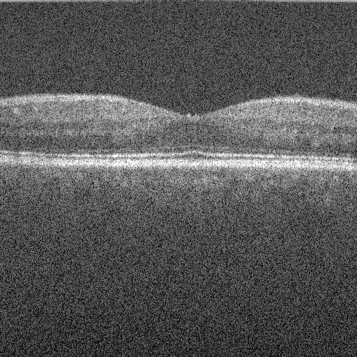
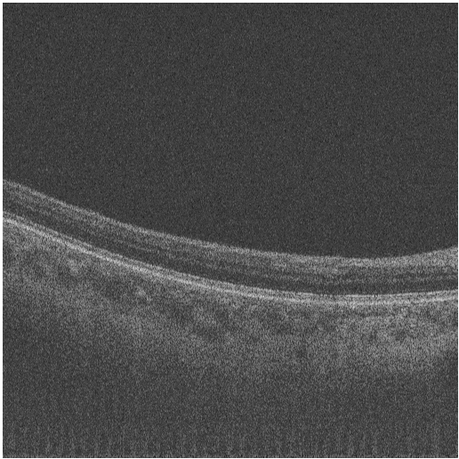
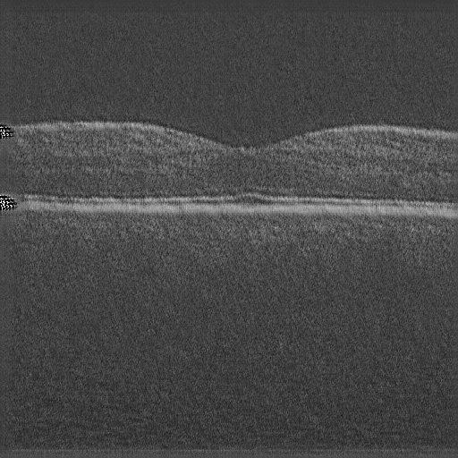

# NAGAN

**This is just a preliminary rough version, we will update these codes later. **

#### Examples:

##### An Image from Source Domain:

##### An Image from Target Domain:

##### Transfered image:

